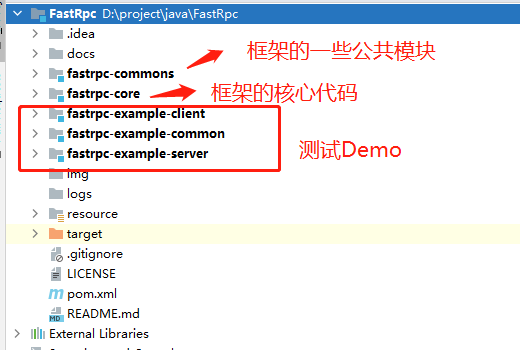
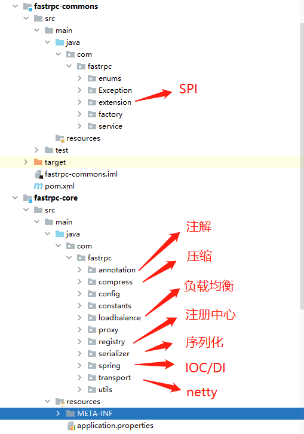
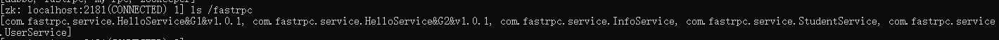
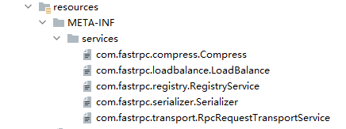

# Fastrpc

### 1.项目介绍

1.Fastrpc是一个第三方对接框架,该框架可以将重复的功能或模块抽取为服务，提高开发效率。

2.该项目在实现上使用zookeeper作为注册中心、netty作为底层通信的框架并且fastrpc支持与SpringBoot框架结合使用,。

3.此项目还没在线上环境中使用过，目前仅适合用于学习与研究，项目也会进一步完善。

4.目前项目中遇到的问题和可扩展的模块会在项目的docs文件下记录。

### 2.Quick Start

​      **1>定义接口**

```java
/**
 * @author: @zyz
 */

public interface HelloService {

    String sayHi(User user);
}
```

   **2>接口实现**

```java
/**
 * @author: @zyz
 *  version :服务版本
 *  group : 服务所在的组.主要用于处理一个接口有多个类实现的情况。
 */
@NoArgsConstructor
@RpcService(group = "G1",version = "v1.0.1")
public class HelloServiceImpl implements HelloService {
    static {
        System.out.println("HelloServiceImpl被创建");
    }
    @Override
    public String sayHi(User user) {
        return "Hello, I am "+user.getName();
    }
}


```

```java
@NoArgsConstructor
@RpcService(group = "G2",version = "v1.0.1")
public class HiServiceImpl implements HelloService {
    static {
        System.out.println("HelloServiceImpl被创建");
    }

    @Override
    public String sayHi(User user) {
        return "Hi, I am "+user.getName();
    }
}
```

**3>RpcServer**

```java

/**
 * @author: @zyz
 * fastrpc 配合框架使用,fastrpc会随着项目启动而自动运行
 */
@Slf4j
@RpcScanner(basePackage = "com.fastrpc")
public class ApplicationServerMain {

    public static void main(String[] args) throws InterruptedException {
        ConfigurableApplicationContext ctx=new AnnotationConfigApplicationContext(ApplicationServerMain.class);
        log.debug ("rpc start");
        // 测试时防止fastrpc框架会随着主线程结束而结束
         Thread.sleep (100000);
    }
}

```

**4>RpcClient**

```javascript
/**
 * @author: @zyz
 */
@Component
public class HelloController {


    @RpcReference(group = "G2",version = "v1.0.1")
    private static HelloService helloService;
    @RpcReference(group = "G1",version = "v1.0.1")
    private static HelloService hiService;

    public  void sayHi()
    {
        User user=new User();
        user.setName("zyz");
        System.out.println (helloService.sayHi(user));
        user.setName("mzd");
        System.out.println (hiService.sayHi(user));

    }


}
```

```java
/**
 * @author: @zyz
 */
@RpcScanner(basePackage = "com.fastrpc")
public class ApplicationClintMain {
   public static void main(String[] args) throws InterruptedException {
      ConfigurableApplicationContext ctx=new AnnotationConfigApplicationContext(ApplicationClintMain.class);
      HelloController helloController= (HelloController) ctx.getBean("helloController");
      helloController.sayHi();
   }
}
```

**5>结果**

```java
Hi, I am zyz

Hello, I am mzd
```


### 3.项目结构





#### 1>注册中心

 该项目使用ZooKeeper作为注册中心,用于对外暴露服务。



**暴露服务的格式:**    接口全类名&组名&版本号

#### 2>网络通信

  fastrpc使用netty4作为底层的通信框架,其中通信协议制定如下:

```java
public class RpcMessageProtocolConstants {

    /**
     * 消息最大长度
     */
    public static final int MAX_FRAME_LENGTH = 8 * 1024 * 1024;
    /**
     * 魔数 用来验证信息身份呢 4byte
     */
    public static final byte[] MAGIC_NUMBER="frpc".getBytes();
    /**
     * 协议版本 1byte
     */
    public  static byte VERSION= VersionEnum.v1.getCode();
    /**
     *  序列化反射
     */
    public static  byte SERIALIZETYPE= SerializationTypeEnum.KYRO.getCode();

    /**
     *  压缩类型 1byte
     */
    public static  byte COMPRESSTYPE= CompressTypeEnum.GZIP.getCode();


}
```

#### 3>SPI

​        传统的JAVA原生SPI缺陷在于无法按需加载。ServiceLoader每次都会加载所有的实现，如果有的没有用到也进行加载和实例化，会造成一定系统资源的浪费。本框架模仿Dubbo的SPI机制,实现类的按需加载。可以通过在@SPI注解上指定接口的默认实现类，也可以在调用接口时指定实现。

​        注意: 使用时需要子啊 resource/META-INF/services 下指定接口的实现

```java
@SPI("kyro")
public interface Serializer {
   <T> byte[] serialize(T msg);

   <T> T deserialize(Class<T> clazz,byte[] bytes);
}

//调用
  Message msg = ExtensionLoader.getExtensionLoader(Serializer.class).getExtension(SerializationTypeEnum.getName("json").deserialize(clazz, bytes);
```



#### 4>负载均衡

使用一致性哈希算法来解决rpc客户端调用远程服务的负载均衡问题

具体可见我的博客: 

https://blog.csdn.net/qq_39552268/article/details/120541616


